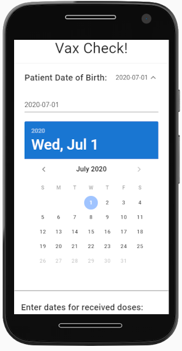
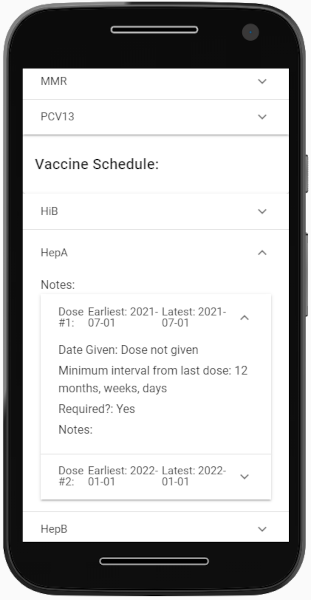

# vaccine-schedule
Tool to help determine vaccine regular or catch-up schedule based on current records. (CDC 2020 guidelines)

## Usage
Input patient's date of birth and dates of vaccinations. App generates a vaccine schedule with earliest dates and any notifications of late doses or excessive doses.  

## Technologies Used

[Vue](https://vuejs.org/)
[Vuetify](https://vuetifyjs.com/en/)
[Luxon](https://moment.github.io/luxon/)

## Story

A medical professional pal of mine was fed up with complicated vaccination dosing rules and timings. I offered to help by creating an app to make the process smoother, generating a schedule based on guidelines posted on the [Center for Disease Control website](https://www.cdc.gov/vaccines/schedules/index.html).

Though the app definitely needs work, it provided me a good introduction to how Vue.js works and I took away data-flow semantics that applies well to Svelte.js and Flutter/Dart.
